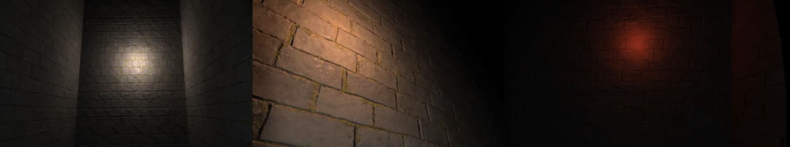

# The Ascent VR
##### Authors: Zergio Ruvalcaba (@Zorten), Salvador Sanchez (@salsan1128), Rishab Dudhia (@rishabdudhia)

## Video Demo

## Introduction
  _The Ascent_ is a virtual reality horror video game. At the start of the game, the player is dropped at the beginning of a dark maze in front of a wall with instructions to complete the game. A flashlight is connected to the player’s hand and they must turn it on to help them see their surroundings and navigate his or her escape. Throughout the maze, there are point lights that are initially turned off to force the user to explore the maze, and once a light is passed, it is turned on to let the player know that they have been there before. The lights also have a color scheme of blue to white to red with blue representing moving away from the start of the maze to red representing the player nearing the end. While traversing the maze, the player must also collect 3 out of the 6 glowing keys placed randomly throughout the maze to unlock the exit gate. If the exit is reached before collecting 3 keys, the door will stay locked and the player is still stuck inside until they acquire 3 keys. 
	
 The project is interesting because we had started brainstorming ideas around Halloween, and we thought it would be really fun to create a spooky game. The darkness of our maze gives an ominous feeling, and to further enhance this feeling, a whisper plays at the start of the game saying “Come back alive.” Initially, when we created the game, we did not have the light system indicating where the player had been, and it resulted in the user taking much longer to complete the maze as the keys were collected quickly but it was difficult to remember where in the virtual maze the player had explored. With this system, it helps the user mentally create a map of the maze as they explore and can further plan and strategize how to go about solving the maze, instead of walking through the same hallway multiple times without recognizing it. 
	
 We decided to restrict the user’s field of view by forcing the user to explore with only the flashlight instead of their entire field of view. While restricting the field of view may increase vection, we hope it causes the user to look around the maze more closely, and with their mind occupied looking for keys and the correct path to the end, their restricted field of view will not be noticed and instead make the game more of a challenge. 
	
 Furthermore, we hope that with VR, the player can enjoy the classic maze game we used to solve as kids, and immerse themselves into a dark and eerie version of the game. Now, you have to hit dead ends, instead of having the bird's eye view to easily see the path to the exit.

## Design

The game begins with you on one end of the maze, and with some instructions written on a wall straight ahead from you.

#### Figure 1: Game instructions

The flashlight can be toggled on and off, and each time a clicking sound plays. The first time the player turns on the flashlight, the whisper mentioned in the Introduction is triggered. 
As soon as the game starts, the player is able to inspect their left hand, which has information about how many keys the player has collected in order to escape. The count is updated as the player traverses the game and picks up more keys. If the player restarts the game, the key count is obviously reset as well.

#### Figure 2: In-game key-count displayed on player’s left hand

The keys around the maze have a green light attached to them in order to make them easier to notice, and to grab the player’s attention. 

#### Figure 3: Key object, with green light to highlight its presence

As the player traverses the game, lights will illuminate places you’ve passed through. As the player gets closer to the exit, the lights will begin to turn red, otherwise they begin to turn blue. This “hot and cold” system is supposed to help guide the player towards the exit.

#### Figure 4: Lights illuminating maze gradually turning red as you near the exit

When the player reaches the exit gate after having collected all the keys, the entire maze will light up, and a message is displayed to the player that they beat the game.

#### Figure 5: Exit gate and celebratory end-game message

  For our game, _The Ascent_, we chose the user interface to be the Oculus Touch controllers. We decided on this because it was the most intuitive, as well as the most immersive, option for our game. The Touch controllers allowed us to map the flashlight to the player’s right hand, which let the player point it in whichever direction they desired. In addition, the trigger and the weight of the controller simulated holding and clicking a flashlight pretty well, increasing player immersion in the game world. If we had used a keyboard and/or mouse, the player would be more aware of those objects, since they are not as intuitive and they don’t allow a free range of motion like the Touch controllers.
  
  To control player movement, we used the joystick on the left Touch controller. By moving the joystick, the player can control and move the character in the 3D space. The right joystick was used to shift the player’s view so they wouldn’t have to physically turn around when traversing the game. When the player slides the right joystick to either side (left or right), the player’s camera view will rotate about 30 degrees in that respective direction. This allows the player to turn the character in any direction in-game, without needing to move their physical body around. 
  
  As stated before, the left Touch controller represents the player’s left hand in-game. The Touch controller can be moved around, and the player can see the hand model follow this same movement in game. The same is true for the right Touch controller, except that instead of a hand, it is the flashlight model. Wherever the player points the right Touch controller, the flashlight will point in that direction, allowing the player to illuminate whichever area they desire.
  
  All other actions are mapped to the buttons and triggers in the Touch controllers. For the right Touch, pressing the A button will restart the game, pressing the B button will quit the game, and the main trigger will toggle the flashlight. For the left Touch, pressing the X button will teleport you the exit, which was a feature we had purely for testing purposes. 
  We followed the VR developer tips discussed in lecture by having mostly simple models in our game. Our entire game world is composed of simple 3D cube objects, with textures applied to them. The only complex models would be the ones we imported, those being the flashlight, the key, and the exit gate. The simplicity of our world made our game not as demanding for the hardware, thus improving the rendering and frame rate.
  
  Furthermore, for all text we displayed, we made sure it was attached to objects in the virtual world, as opposed to floating on the screen. The best example of this would be the key count on the hand. We spent some time thinking how to display this information, since the player must be able to access it at all times. We found that attaching this text to the hand model worked really well, as it was really only visible when you raised up and looked at it, and since the text is right on top, it seemed natural, as if you were reading a watch. 
  As mentioned above, our game is not super demanding on the hardware, so as long as the Oculus can run on the hardware being used, then technical performance should not be a problem. For the best user experience however, it would be best if both speakers on the headset are in working condition and with the volume turned up, in order to immerse more into the game’s atmosphere. The user experience would also be improved if the player has plenty of space to turn and look around. 

## Implementation

The game uses a few scripts and functions to manage the lighting (World light, wall lights, and flashlight), objects (player, keys, and text), audio, and game status (restart, endgame, and quit).

## Scripts 

- **GameManager:** In the start function of the game manager script, it initializes the text on the player’s hand to show that they have collected 0 keys out of 3 (or however many are needed to open the gate).
	- The _Update_ function continuously checks to see if the player has pressed any of the keys to close the game. If so, it closes the game.
 	- The _incKeysCollected_ function is a public function that increments the number of keys collected, updates the keys collected text, and when enough keys are collected sets a flag to true.
 
- **EndGame:** The script is attached to the exit gate and is mainly used to handle restarts and endgame scenarios.
	- The _Start_ function gets the audio source for the gate opening as well as ensuring the winning message is not visible. 
	- The _Update_ function checks to see if the player has collected enough keys or if the restart button has been pressed. If enough keys have been collected, it removes the extra keys from the maze and plays the audio of the gate opening. If the restart button has been pressed, it moves the player back to the start position, ensures that the maze is dark, resets the keys in the maze, turns off the wall lights, and updates the keys collected and the keys collected text to 0.
	- Since the script is attached to the gate the _OnTriggerEnter_ function runs when the player collides with the gate. If the player has enough keys, it once again plays the gate opening audio, lights up the maze, and shows the endgame text.
 
 - **KeyManager:** The script is attached to each key object. It has only one function, _OnTriggerEnter_, which runs when the player collides with a key, increments the keys collected, and removes that key object from the maze.
 
- **LightColliders:** This script is attached to each wall light object. In its start function, it makes sure that each wall light is off. 
	- In the _OnTriggerEnter_ function, when a player “collides” (enters its box collider) it turns on the wall light.
 
- **FlashlightToggle:** This script is attached to the flashlight object the player is holding. The _Start_ function initializes the flashlight to be off and gets an audio source.
	- The _Update_ function checks to see if the flashlight toggle button has been pressed. If so, it plays the click audio clip and toggles the flashlight to on or off. If it is the first time that it is being pressed, it plays the whisper audio clip.

## Open-Source Code/Assets Used 

#### Existing open-source code

- **OVR plugin:** This was used to implement the Oculus capabilities.

- **FlashlightToggle:** Came with the Rusty Flashlight asset, to help implement a toggle on and off for the flashlight model. However, we did slightly modify it to be able to work the way we intended it to.

#### Free Assets
 
- [MDP 4K Texture Pack Vol.1](https://assetstore.unity.com/packages/2d/textures-materials/stone/mdp-4k-texture-pack-vol-1-139525) by [Adventure Forge](https://assetstore.unity.com/publishers/12038)
	- Used the textures in this pack for the maze walls, the floor, and the ceiling.
- [Rusty Flashlight](https://assetstore.unity.com/packages/3d/props/tools/rusty-flashlight-122403) by [Brittany Bolick](https://assetstore.unity.com/publishers/36806) 
	- Used as the model for the player’s flashlight.
- [Dwarven Expedition Pack - Stylized Assets](https://assetstore.unity.com/packages/3d/environments/dungeons/dwarven-expedition-pack-stylized-assets-155149) by [Tobyfredson](https://assetstore.unity.com/publishers/11721)
	- Used the DungeonGate model as the exit gate for the maze.
- [Rust Key](https://assetstore.unity.com/packages/3d/props/rust-key-167590) by [Aleksn09](https://assetstore.unity.com/publishers/39424)
	- Used as the model for the keys to open the gate.
- [Help Me](https://www.dafont.com/help-me.font) by [GGBotNet](https://www.dafont.com/ggbot.d8252)
	- Used as the font for all of the text in the maze.
- [Horror Ambient](https://pixabay.com/sound-effects/horror-ambient-14590/) by mr45
	- Used as the ambiance music throughout the game.
- [Flashlight Switch](https://pixabay.com/sound-effects/flashlight-switch-102792/) by Kinoton
	- Used for the flashlight toggle audio.
- [Creaking Wood](https://pixabay.com/sound-effects/creaking-wood-46095/) by Breviceps
	- Used for the gate opening audio, when all keys are collected and the exit is reached.
- [come back alive whisper](https://pixabay.com/sound-effects/come-back-alive-whisper-6299/) by LadyImperatrix
	- Used for the first time the flashlight is toggled on.
 
## Lessons Learned

One of the most time-consuming aspects of this project was creating the maze. We tried finding assets or a tool that would help us create the 3D maze, but we ended up building it up ourselves in Unity, using purely 3D cube objects. Although tedious, this allowed us to construct the maze however we wanted, which was helpful later on as we ended up reducing its size and changing the layout. 

Another problem we ran into was making it so the maze would be completely dark. Initially, we simply changed the skybox into a solid dark color. This worked at the beginning, however at the end of the game when the maze is supposed to light up, when we turned the skybox into a light color, only the outside of the maze we constructed would light up, meaning everything but the area we wanted to illuminate would light up. We fixed this by using a dark cubemap on top of the dark skybox, and when we wanted to light up the world we changed the rendering to use a light skybox and light cubemap.

Another substantial problem we ran into was actually finishing the game. Even as we played it, we would get constantly lost and found it extremely difficult to find the exit without help. Because of this, we cut the size of the maze almost by half and streamlined the paths the user could take a bit more. This improved the difficulty of the game, however, it would still take a while to find the exit and it could be a bit boring since you were just walking around. To remediate this, we added the keys to the game as a necessary collectible. This made it so the player had a goal besides just walking around and finding an exit, which made the game way more engaging. This made the game more enjoyable, yet it was still easy to get lost. To fix this problem, we decided to add the “hot and cold” colored light system, in order to help guide the player towards the exit. This made the game actually playable within a reasonable amount of time, and also more aesthetically appealing since the colored lights added a nice glow to the dark maze.

Users of the game found it quite interesting and immersive as they were scared about jump scares that could potentially pop out of the darkness. Even though we did include any, that would have been a nice addition to our game. During our testing stage, we did get reviews from other users that the maze was difficult to navigate before we added the light system as a way to track what areas of the maze had been explored. After the light system was added, there were much better responses as the time taken to finish the maze dropped significantly and users stopped losing interest in the game. One last improvement suggested during our demo was that it would have been cool if there was a timer or a monster chasing the user making them feel even more pressured to finish the maze. 
	
 
For distributing the workload, we each sat together at the lab computer on lab days and some Fridays when lab office hours were held. One person would be at the keyboard and mouse controlling what we wanted to do in Unity, while we all talked through problems and possible solutions. There were not many times when someone had to shoulder work by themselves and even if one of us could not be present in person we would get on a Zoom call to confer about problems we were having. Therefore, there is not one thing that one person did, however, it was more like all three of us did everything from scripting to creating the layout of the maze as we talked in real time about decisions to be made. After deciding, we implemented and tested with one person wearing the VR headset and entering the game while the two others troubleshot from the console output seeing the world view and tracking the player inside of the game for any adjustments that needed to be made.
